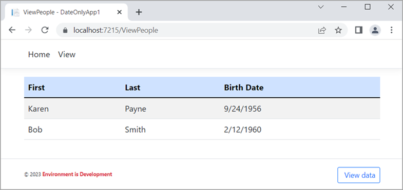
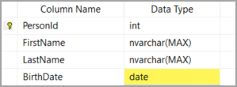

# About

This project is a mirror image of the console project DateOnlyApp.

> **Note**
> Run the project DateOnlyApp which will create and populate the database or run the script under the script folder.




# Table definition



# Conversion

Is done for all DateOnly in `OnModelCreatingPartial`

```csharp
public partial class Context : DbContext
{
    public Context()
    {
    }

    public Context(DbContextOptions<Context> options)
        : base(options)
    {
    }

    public virtual DbSet<Person> Person { get; set; }

    protected override void OnModelCreating(ModelBuilder modelBuilder)
    {
        modelBuilder.Entity<Person>(entity =>
        {
            entity.Property(e => e.BirthDate).HasColumnType("date");
        });
        modelBuilder.HasSequence<int>("seq_test").HasMin(1L);

        OnModelCreatingPartial(modelBuilder);
    }

    partial void OnModelCreatingPartial(ModelBuilder modelBuilder);
    protected override void ConfigureConventions(ModelConfigurationBuilder builder)
    {
        builder.Properties<DateOnly>()
            .HaveConversion<DateOnlyConverter>()
            .HaveColumnType("date");

        base.ConfigureConventions(builder);
    }
}
```
