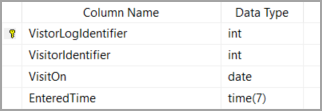

# About

An example for reading `DateOnly` and `TimeOnly` from a SQL-Server database table using `Microsoft.Data.SqlClient` version `5.1.0-preview2.22314.2`

If you are use to working with a data provider via a connection and command object the following will be familar.



The following language extensions make reading data easy as shown in the second code block.

```csharp
internal static class Extensions
{

    public static DateOnly GetDateOnly(this SqlDataReader reader, int index)
        => reader.GetFieldValue<DateOnly>(index);

    public static string GetDateOnlyFormatted(this SqlDataReader reader, int index)
        => reader.GetFieldValue<DateOnly>(index).ToString("MM/dd/yyyy");

    public static TimeOnly GetTimeOnly(this SqlDataReader reader, int index)
        => reader.GetFieldValue<TimeOnly>(index);

    public static string GetTimeOnlyFormatted(this SqlDataReader reader, int index)
        => reader.GetFieldValue<TimeOnly>(index).ToString("hh:mm tt");
}
```

Read operations

```csharp
internal class DataOperations
{
    /// <summary>
    /// Example for reading <see cref="DateOnly"/> and <see cref="TimeOnly"/> with <see cref="SqlDataReader"/>
    /// </summary>
    /// <returns></returns>
    public static async Task Read()
    {
  
        var statement =
            "SELECT VL.VisitOn, VL.EnteredTime, VL.ExitedTime FROM Visitor AS V " + 
            "INNER JOIN VisitorLog AS VL ON V.VisitorIdentifier = VL.VisitorIdentifier WHERE (V.VisitorIdentifier = 1);";

        await using var cn = new SqlConnection(ConfigurationHelper.ConnectionString());
        await using var cmd = new SqlCommand { Connection = cn, CommandText = statement };

        await cn.OpenAsync();
        await using var reader = await cmd.ExecuteReaderAsync();

        reader.Read();

        var logItem = new VisitorLog()
        {
            VisitOn = reader.GetDateOnly(0), 
            EnteredTime = reader.GetTimeOnly(1), 
            ExitedTime = reader.GetTimeOnly(2)
        };
    }
}
```