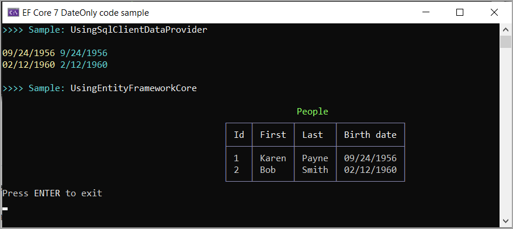

# Table of content
<!--TOC-->
- [EF Core 7 DateOnly](#ef-core-7-dateonly)
- [Script](#script)
- [SqlClient](#sqlclient)
- [References](#references)
<!--/TOC-->

In these code samples you will learn how to use `DateOnly` with EF Core 7 with little effort and with SqlClient data provider using a preview version.

# EF Core 7 DateOnly

Many post on the web will say `DateOnly` is a long time coming, let’s skip that.

Let's see a simple example

```csharp
DateOnly exampleDateOnly = new DateOnly(2022, 8, 21);
Console.WriteLine(exampleDateOnly);
```

Which outputs 8/21/2022


What is great about `DateOnly` is we can now query a date type in a SQL-Server database table.

For this example we have a DateOnly column, BirthDate.


**Model**

```csharp
public partial class Person
{
    public int PersonId { get; set; }
    public string FirstName { get; set; }
    public string LastName { get; set; }
    public DateOnly? BirthDate { get; set; } 
}
```

As with other code samples in this repository we can use [HaveConversion](https://docs.microsoft.com/en-us/ef/core/modeling/value-conversions?tabs=data-annotations)

The model above after reverse engineering had DateTime, I changed it to DateOnly following by implementing a class to perform a conversion from DateTime to DateOnly.

```csharp
internal class DateOnlyConverter : ValueConverter<DateOnly, DateTime>
{
    public DateOnlyConverter()
        : base(d => d.ToDateTime(TimeOnly.MinValue),
            d => DateOnly.FromDateTime(d)) { }
}
```

Then in the DbContext to perform conversions on any column that is DateOnly.

```csharp
protected override void ConfigureConventions(ModelConfigurationBuilder builder)
{
    builder.Properties<DateOnly>()
        .HaveConversion<DateOnlyConverter>()
        .HaveColumnType("date");
    base.ConfigureConventions(builder);
}
```

> **Note**
> It may be a possibility that the next release of EF Core will have a conversion built in for DateOnly.

Results from reading data




# Script

~~The script under the Scripts folder is the same as HasConversion project with the addition of the Person table~~

Changed code so that the database is created and populated in code.

- See Context, [HasData](https://learn.microsoft.com/en-us/ef/core/modeling/data-seeding#model-seed-data)

# SqlClient

Microsoft.Data.SqlClient as of 11/10/2022 there is support for DateOnly and TimeOnly for `SqlParameter` value and `GetFieldValue`

```csharp
var statement = "SELECT PersonId,FirstName,LastName,BirthDate FROM dbo.Person";
await using var cn = new SqlConnection(ConfigurationHelper.ConnectionString());
await using var cmd = new SqlCommand { Connection = cn, CommandText = statement };
        
await cn.OpenAsync();
await using var reader = await cmd.ExecuteReaderAsync();

while (reader.Read())
{
    AnsiConsole.MarkupLine($"[yellow]{reader.BirthDate().ToString("MM/dd/yyyy")}[/]");
}
```

<br>

```csharp
internal static class Extensions
{
    public static DateOnly BirthDate(this SqlDataReader reader) 
        => reader.GetFieldValue<DateOnly>(3);
}
```


# References

- Microsoft docs [DateOnly Struct](https://docs.microsoft.com/en-us/dotnet/api/system.dateonly?view=net-6.0)