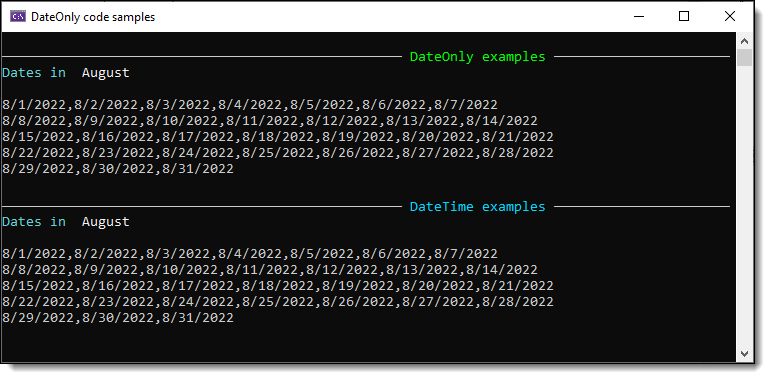
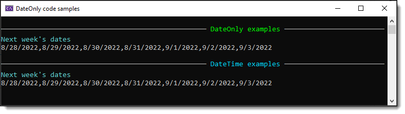

# About

Many post on the web will say `DateOnly` is a long time coming, let’s skip that.

In this project I will show code samples done with `DateTime` than take those examples and use `DateOnly` as a repacement.

The idea is to show that with little effort old code can be updated from DateTime to DateOnly.

# Example 1
This method gets all days in a month as DateTime list.

```csharp
public static List<DateTime> GetMonthDays(int month)
{
    var year = DateTime.Now.Year;

    return Enumerable.Range(1, DateTime.DaysInMonth(year, month))
        .Select(day => new DateTime(year, month, day))
        .ToList();
}
```

The same method using DateOnly

```csharp
public static List<DateOnly> GetMonthDays(int month)
{
    var year = DateTime.Now.Year;

    return Enumerable.Range(1, DateTime.DaysInMonth(year, month))
        .Select(day => new DateOnly(year, month, day))
        .ToList();
}
```

</br>

:small_orange_diamond: difference between the two is `Select`, DateOnly vs DateTime.

## Results



# Example 2

This example returns dates for the upcoming week, one DateTime, one DateOnly.

DateTime version

```csharp
public static DateTime Next(this DateTime from, DayOfWeek dayOfWeek)
{
    int start = (int)from.DayOfWeek;
    int target = (int)dayOfWeek;
    if (target <= start)
    {
        target += 7;
    }

    return from.AddDays(target - start);
}

public static List<DateTime> NextWeeksDates() =>
    Enumerable.Range(0, 7).Select(index =>
        DateTime.Now.Next(DayOfWeek.Sunday).AddDays(index)).ToList();
```

DateOnly version

```csharp
public static List<DateOnly> NextWeeksDates()
    => Enumerable.Range(0, 7).Select(index =>
            DateOnly.FromDateTime(DateTime.Now).Next(DayOfWeek.Sunday).AddDays(index))
        .ToList();

/// <summary>
/// Helper for <see cref="NextWeeksDates"/>
/// </summary>
/// <param name="from"></param>
/// <param name="dayOfWeek"></param>
/// <returns></returns>
public static DateOnly Next(this DateOnly from, DayOfWeek dayOfWeek)
{
    int start = (int)from.DayOfWeek;
    int target = (int)dayOfWeek;

    if (target <= start)
    {
        target += 7;
    }

    return from.AddDays(target - start);
}
```

</br>

:small_orange_diamond: difference DateOnly.FromDateTime is needed in NextWeekDates for a bridge.

## Results

