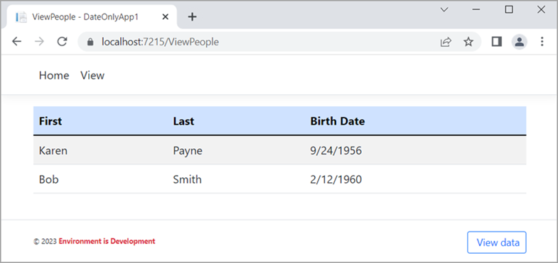
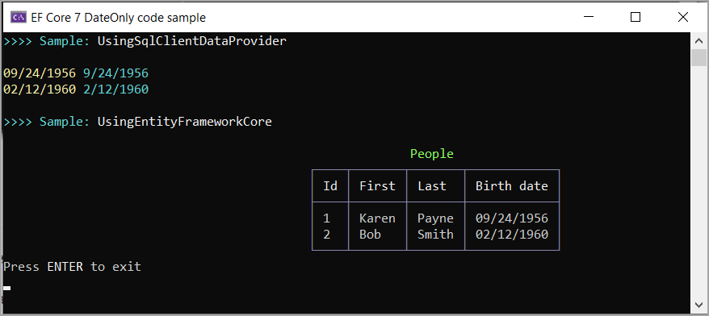

# Working with DateOnly primer

This repository shows how to use [DateOnly Struct](https://docs.microsoft.com/en-us/dotnet/api/system.dateonly?view=net-6.0) with basic operations and shows how to take DateTime to DateOnly.

Every developer/coder at some point will work with dates. For the majority of those working with dates using DateTime will suffice for most task while for others with needs such as interacting with a database which has column type of date it can be awkward transposing from DateTime to date and then it’s now a string. Also, when there is a need to work with json files, the same applies so DateOnly is a welcome addition to the .NET Framework.



</br>




## Project WorkingWithDateOnly shows 

- How to get days for the following week and how to get all days in a month using both DateTime and DateOnly 
- How to serialize and deserialize a model using custom converters as without these converters JsonSerializer does not know how to deal with DateOnly and also TimeOnly

## Project DateOnlyApp shows


Since Entity Framework Core (EF Core) does not natively handle DateOnly a [ValueConverter](https://docs.microsoft.com/en-us/ef/core/modeling/value-conversions?tabs=data-annotations) is needed and is simply to use, full explanation is in this projects readme file.

The following code will take all DateOnly properties in all models from DateTime to DateOnly where in this case in SQL-Server the column type s Date.

```csharp
internal class DateOnlyConverter : ValueConverter<DateOnly, DateTime>
{
    public DateOnlyConverter()
        : base(d => d.ToDateTime(TimeOnly.MinValue),
            d => DateOnly.FromDateTime(d)) { }
}
```

</br>

```csharp
protected override void ConfigureConventions(ModelConfigurationBuilder builder)
{
    builder.Properties<DateOnly>()
        .HaveConversion<DateOnlyConverter>()
        .HaveColumnType("date");
    base.ConfigureConventions(builder);
}
```

# Project NewtonsoftDateOnlyTimeOnlyApp

Shows how to work with DateOnly with Bogus library and Json.net library

# How to work with provided code

First off, Microsoft Visual Studio 2022 or higher is required along with running Microsoft SQL-Server (at least Express edition for the EF Core project) .


Once the repository has been cloned, open in Visual Studio, find the database script under the Script folder in the project DateOnlyApp. Using SQL-Server Management Studio (SSMS) create a new database named HasConversions then run the provided script.

Back in Visual Studio, build the projects (if not interested in EF Core, unload the project). I recommend setting the project WorkingWithDateOnly as the start-up project. Run this project then go into the source code and inspect each line of code to get a understanding how the code works rather than copy-n-paste into your project which is unwise as we must not just expect code to work but to understand the code else on failure the average developer/coder needs to ask how to get their code working in a developer forum.

Note there is a class named JsonOperations in the project WorkingWithDateOnly which is not executed. If working with json is important, go ahead and run the code.

# Stackoverflow post

The property could not be mapped because it is of type 'DateOnly', which is not a supported primitive type or a valid entity type

[My reply](https://stackoverflow.com/questions/73884768/the-property-could-not-be-mapped-because-it-is-of-type-dateonly-which-is-not/73885097#73885097)


# References

- Microsoft docs - [DateOnly Struct](https://docs.microsoft.com/en-us/dotnet/api/system.dateonly?view=net-6.0)
- [Entity Framework Core working with dates](https://github.com/karenpayneoregon/ef-core-5-dates-csharp)
- [Working with DateTime](https://github.com/karenpayneoregon/working-with-datetime)
- [EF Core Value Conversions](https://github.com/karenpayneoregon/ef-core-transforming)